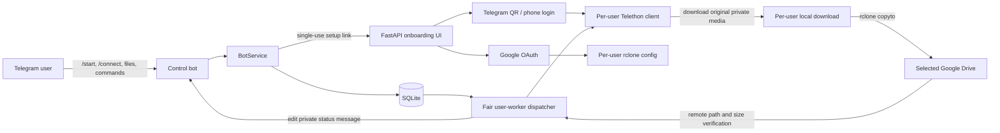

# Telegram Stremio

Telegram Stremio is a private, multi-user Telegram-to-Google Drive uploader.
Each user sends or forwards a file to the bot, connects their own Telegram
account and Google Drive through a short-lived onboarding page, and receives
live download and upload progress in the same private bot conversation.

The service is built with Python 3.12, Telethon, FastAPI, SQLite, rclone, and
Docker. Files are streamed through local disk rather than loaded completely
into memory.

> **Disclaimer:** This project is intended for transferring files that users
> own or are authorised to access. It does not bypass Telegram restrictions,
> DRM, paywalls, or copyright protections. Users are responsible for complying
> with Telegram's Terms of Service, cloud-storage policies, and applicable
> copyright laws.

## What the service provides

- Private bot conversations; no shared processing group is required.
- One isolated Telegram user session per registered user.
- One isolated rclone configuration and download directory per user.
- QR or phone-number Telegram login, including optional Telegram 2FA.
- Multiple Google Drive accounts per user with verified account identities.
- Persistent per-user Drive, root-directory, and child-directory selections.
- Fair FIFO scheduling across users with one active job per user.
- Parallel Telegram downloads with automatic sequential fallback.
- Live Telegram progress for queueing, downloading, uploading, completion,
  cancellation, and failure.
- Upload collision handling and remote size verification.
- SQLite-backed crash recovery.
- A private onboarding UI that can run at a domain root or under a shared
  domain path such as `/uploader`.
- Docker health checks, non-root execution, resource limits, and GitHub Actions
  deployment.

## Architecture



### Component responsibilities

| Component | Responsibility |
| --- | --- |
| `app/main.py` | Starts the database, bot, connected user clients, dispatcher, maintenance task, and FastAPI server. |
| `app/bot_service.py` | Handles private bot commands, validates file submissions, creates jobs, and sends status messages. |
| `app/web.py` | Serves the onboarding UI and authenticated Telegram/Google connection endpoints. |
| `app/telegram_onboarding.py` | Runs temporary QR or phone login sessions and promotes a verified session into the user's private data directory. |
| `app/oauth_service.py` | Runs Google OAuth, verifies Google account identity, prevents duplicate accounts, and creates rclone remotes. |
| `app/client_manager.py` | Maintains one authorized Telethon client for each connected Telegram user. |
| `app/dispatcher.py` | Selects queued jobs fairly, downloads media, uploads it, reports progress, and recovers interrupted work. |
| `app/rclone_service.py` | Manages per-user remotes, executes uploads, parses progress, handles collisions, and verifies remote files. |
| `app/database.py` | Provides the serialized SQLite repository, schema migration, queue queries, and token claiming. |
| `app/maintenance.py` | Expires temporary setup state and restarts transiently unavailable user sessions. |

## End-to-end flow

### 1. Register and connect

1. The user opens a private conversation with the bot and sends `/start`.
2. The bot creates or updates that user's SQLite record.
3. The user sends `/connect`.
4. The bot creates a short-lived, single-use setup token and returns an HTTPS
   onboarding link.
5. Opening the link exchanges the token for an HTTP-only web session cookie.
6. The user connects the same Telegram account using either:
   - QR login; or
   - international phone number, Telegram login code, and 2FA password when
     enabled.
7. The service confirms that the authenticated Telegram ID matches the user
   who opened the setup link.
8. The user authorizes Google Drive. The service verifies the Google identity,
   creates a private rclone remote, and confirms that the Drive is accessible.

Phone numbers, Telegram login codes, and 2FA passwords are held only for the
active login flow; they are not stored in SQLite.

### 2. Submit a file

1. The user sends or forwards media privately to the bot.
2. The bot verifies that the user has:
   - registered with `/start`;
   - an active Telegram user session;
   - a selected and accessible Google Drive;
   - a file within the optional application size limit.
3. The bot sanitizes the filename and snapshots the currently selected remote,
   root directory, and child directory into a durable job.
4. A private status reply is created with the job ID, destination, and a random
   source reference.

The destination snapshot means that later `/remote`, `/dirroot`, or `/dir`
changes affect only future submissions.

### 3. Schedule, download, and upload

1. The dispatcher selects the oldest queued file for each available user.
2. A user can occupy only one worker, even if that user has several queued
   files.
3. The owner's Telethon client finds the bot's reference reply in that user's
   private bot conversation and follows the reply back to the original media.
4. Large files use multiple aligned Telegram download lanes. If a lane stalls
   or parallel transfer fails, all lanes are cancelled and the file restarts
   with Telethon's sequential downloader.
5. The completed local file size is compared with Telegram metadata.
6. rclone uploads the file to the destination captured by the job.
7. Completion is reported only after the remote object exists and its size
   matches the source.
8. The local file is deleted after verified success when
   `DELETE_LOCAL_AFTER_SUCCESS=true`.

If the service restarts while a job is downloading or uploading, the active
job is returned to `QUEUED`. The original media must still be available in the
user's private bot conversation for processing to resume.

## Queue and concurrency model

`MAX_CONCURRENT_USER_WORKERS` is the number of distinct users who may process
one file each at the same time. A worker covers the complete download-to-upload
lifecycle.

With two workers:

```text
User 1: file A, file B
User 2: file C
User 3: file D
```

`file A` and `file C` can run together. `file B` cannot occupy a second worker
while User 1 is active. User 3 remains queued until a worker is free. Candidate
users are ordered by the creation time and ID of their oldest queued job.

This provides:

- global submission-time priority;
- at most one active file per user;
- parallel work for different users;
- no queue monopolization by one account.

## Cloud destinations

Every job uploads to:

```text
<selected-remote>:<root-directory>/<child-directory>/<filename>
```

The first connected Drive normally uses `gdrive`. Additional Drives use
`gdrive_02`, `gdrive_03`, and so on.

The default root directory is the user's Telegram first name plus last name,
converted to uppercase and sanitized. If no usable name exists, the fallback
is `USER_<telegram-user-id>`.

Example:

```text
Telegram name: Goutham S
Selected remote: gdrive_02
Root: GOUTHAMS
Directory: DOWNLOADS

Destination:
gdrive_02:GOUTHAMS/DOWNLOADS/example.mkv
```

Users can override the destination for future jobs:

```text
/remote gdrive_02
/dirroot GOUTHAM
/dir Series/Season 01
```

The resulting destination is:

```text
gdrive_02:GOUTHAM/Series/Season 01/example.mkv
```

`REMOTE_COLLISION_POLICY` controls an existing destination:

- `rename` creates names such as `example_1.mkv`;
- `overwrite` keeps the requested destination;
- `skip` fails the job instead of replacing the file.

## Bot commands

All supported interaction occurs in a private conversation with the bot.

| Command | Description |
| --- | --- |
| `/start` | Register or refresh the private user record. |
| `/connect` | Create a single-use link for connecting or managing Telegram and Google Drive. |
| `/tutorial` | Send the illustrated setup and playback guide. This also works before registration. |
| `/status` | Show live Telegram/Drive connection state, destination preferences, and job counts. |
| `/cancel [job-id]` | Cancel the specified owned job, or the user's oldest active/queued job when no ID is supplied. |
| `/dirroot` | Show the current cloud root directory. |
| `/dirroot <name>` | Set a custom uppercase cloud root for future jobs. |
| `/dirroot default` | Restore the root generated from the Telegram name. |
| `/dir` | Show the current child directory and complete destination. |
| `/dir <path>` | Set the child directory for future jobs; `/` may separate up to ten nested segments. |
| `/remote` | Show the selected remote and available remotes. |
| `/remote <name>` | Select a connected Drive for future jobs. |
| `/remotes` | List connected remote names and Google account emails. |
| `/ls` | List commands available to the requesting user. |
| `/help` | Show the same permission-aware command list. |

### Administrator commands

Set `ADMIN_TELEGRAM_USER_ID` to one numeric Telegram user ID to enable read-only
operational reports for that account:

| Command | Description |
| --- | --- |
| `/db users` or `/db user` | List users, connection state, destinations, and job totals. |
| `/db user <user-id>` | Show one user's operational details. |
| `/db activeworks` | Show queued, downloading, downloaded, and uploading jobs. |
| `/db stats` | Show user totals and job totals grouped by status. |
| `/db failed [limit]` | Show recent failed jobs; the default is 10 and the maximum is 50. |

These reports do not expose session paths, OAuth state, onboarding tokens,
rclone credentials, or Google tokens.

## Prerequisites

- Docker Engine and Docker Compose v2.
- A Telegram account for creating the application credentials.
- A Telegram bot token from
  [@BotFather](https://core.telegram.org/bots/tutorial).
- A Telegram API ID and API hash from
  [my.telegram.org](https://core.telegram.org/api/obtaining_api_id).
- A Google Cloud project with the Google Drive API enabled.
- A Google OAuth 2.0 **Web application** client.
- HTTPS and a reverse proxy for production onboarding.
- Free local disk space for each active file plus the configured reserve.

The image supports Linux `amd64` and `arm64`.

## Credential setup

### Telegram

1. Sign in to [my.telegram.org](https://my.telegram.org).
2. Open **API development tools** and create an application.
3. Copy its `api_id` and `api_hash` into `TELEGRAM_API_ID` and
   `TELEGRAM_API_HASH`.
4. Message [@BotFather](https://t.me/BotFather), run `/newbot`, and create the
   control bot.
5. Put the returned token in `TELEGRAM_BOT_TOKEN`.

Treat the API hash and bot token as secrets. Anyone with the bot token can
control the bot.

### Google Drive OAuth

1. Create or select a project in Google Cloud Console.
2. Enable the Google Drive API.
3. Configure the OAuth consent screen.
4. If the app remains in testing mode, add every intended Google account as a
   test user.
5. Create an OAuth client with application type **Web application**.
6. Add the exact callback used by this service as an authorized redirect URI.
7. Copy the client ID and secret into `GOOGLE_CLIENT_ID` and
   `GOOGLE_CLIENT_SECRET`.

Examples:

```text
Local:
http://localhost:8080/api/storage/google/callback

Dedicated production domain:
https://uploader.example.com/api/storage/google/callback

Shared domain path:
https://playbuddy.zapto.org/uploader/api/storage/google/callback
```

The value registered in Google Cloud must exactly match
`GOOGLE_REDIRECT_URI`, including scheme, hostname, path, case, and trailing
slash behavior.

The service requests OpenID identity/email scopes and Google Drive access. It
uses the verified Google account identity to prevent the same user from adding
one Google account more than once.

## Local development

### 1. Create the environment file

PowerShell:

```powershell
Copy-Item .env.example .env
```

Linux, macOS, or WSL:

```bash
cp .env.example .env
```

For local development, override the server-oriented URLs in `.env`:

```env
PUBLIC_BASE_URL=http://localhost:8080
GOOGLE_REDIRECT_URI=http://localhost:8080/api/storage/google/callback
```

Add the same localhost callback to the Google OAuth client, then fill in the
Telegram and Google credentials.

### 2. Build and start

```bash
docker compose build --no-cache
docker compose up -d
docker compose logs -f telegram-uploader
```

The Compose file publishes the UI on `127.0.0.1:8080`, so open:

```text
http://localhost:8080
```

### 3. Connect the first user

1. Open the bot privately.
2. Send `/start`.
3. Send `/connect`.
4. Open the returned URL on the same computer. Telegram does not make
   `localhost` URLs clickable, so copy and paste it into the browser.
5. Connect the same Telegram account using QR or phone login.
6. Connect Google Drive.
7. Send `/status` and confirm both connections.
8. Send or forward an authorized test file.

On one mobile device, phone login is easier than photographing a QR code and
scanning it from the same device.

## Production deployment

Production uses `docker-compose.prod.yml`, which expects an existing image
named `telegram-uploader:latest`. It applies:

- a 700 MiB memory limit;
- a 256 MiB memory reservation;
- a PID limit of 128;
- loopback-only web publishing;
- all Linux capabilities dropped;
- `no-new-privileges`;
- a 90-second graceful stop window;
- an HTTP health check.

### Required server directory

The included GitHub Actions workflow deploys to:

```text
~/telegram-uploader
```

Prepare it once:

```bash
mkdir -p ~/telegram-uploader/data/users
mkdir -p ~/telegram-uploader/data/pending-telegram
mkdir -p ~/telegram-uploader/data/logs
mkdir -p ~/telegram-uploader/config/users
cd ~/telegram-uploader
```

Create `.env` directly on the server. Do not commit or copy an existing local
user database, Telegram session, or rclone configuration if production users
will connect from the beginning.

On Linux, the container runs as UID/GID `10001:10001`:

```bash
sudo chown -R 10001:10001 data config/users
sudo chmod 700 data/users data/pending-telegram config/users
```

### Use an existing HTTPS domain under `/uploader`

This layout keeps an existing application at the domain root:

```text
https://playbuddy.zapto.org/           -> existing application
https://playbuddy.zapto.org/uploader/  -> Telegram Stremio onboarding
```

Set:

```env
PUBLIC_BASE_URL=https://playbuddy.zapto.org/uploader
GOOGLE_REDIRECT_URI=https://playbuddy.zapto.org/uploader/api/storage/google/callback
```

Add the contents of
[`deploy/nginx/uploader-path.conf.example`](deploy/nginx/uploader-path.conf.example)
inside the existing HTTPS `server` block:

```nginx
location = /uploader {
    return 301 /uploader/;
}

location /uploader/ {
    proxy_pass http://127.0.0.1:8080/;
    proxy_http_version 1.1;
    proxy_set_header Host $host;
    proxy_set_header X-Real-IP $remote_addr;
    proxy_set_header X-Forwarded-For $proxy_add_x_forwarded_for;
    proxy_set_header X-Forwarded-Proto https;
    proxy_set_header X-Forwarded-Prefix /uploader;
    proxy_read_timeout 60s;
}
```

The trailing slash in `proxy_pass http://127.0.0.1:8080/;` is required. It
removes `/uploader/` before forwarding the request to FastAPI.

Validate and reload Nginx:

```bash
sudo nginx -t
sudo systemctl reload nginx
```

Register the complete prefixed callback in Google Cloud. If the callback still
opens the application at `/`, Nginx is missing this path-specific location or
the location is outside the active HTTPS server block.

### Use a dedicated domain

For a dedicated hostname, set root URLs:

```env
PUBLIC_BASE_URL=https://uploader.example.com
GOOGLE_REDIRECT_URI=https://uploader.example.com/api/storage/google/callback
```

Use [`deploy/nginx/telegram-stremio.conf`](deploy/nginx/telegram-stremio.conf)
as a starting point, replace the example hostname and certificate paths, then
enable the Nginx site.

### Why Compose publishes `127.0.0.1:8080`

The binding:

```yaml
ports:
  - "127.0.0.1:8080:8080"
```

makes the onboarding server reachable from Nginx on the same host but not
directly exposed to the public internet on port 8080. HTTPS, the public
hostname, and internet-facing access remain Nginx's responsibility.

## GitHub Actions deployment

[`.github/workflows/deploy.yml`](.github/workflows/deploy.yml) performs:

1. checkout;
2. Python dependency installation;
3. source compilation;
4. the full pytest suite;
5. a production Docker build;
6. `docker save`;
7. SCP of the image archive and `docker-compose.prod.yml`;
8. `docker load` on the server;
9. container recreation;
10. health-check verification;
11. temporary archive and unused-image cleanup.

Configure these repository settings under
**Settings -> Secrets and variables -> Actions**:

| Type | Name | Value |
| --- | --- | --- |
| Secret | `SERVER_HOST` | Oracle/server hostname or IP address. |
| Secret | `SSH_PRIVATE_KEY` | Private SSH key used by the workflow. |
| Variable | `SERVER_USER` | SSH user, for example `ubuntu`. |

The workflow does not replace the server's `.env`, `data/`, or `config/users/`.

For a manual deployment:

```bash
cd ~/telegram-uploader
docker load -i telegram-uploader.tar
docker compose -f docker-compose.prod.yml up -d --force-recreate --remove-orphans
docker compose -f docker-compose.prod.yml ps
docker compose -f docker-compose.prod.yml logs --tail=100 telegram-uploader
```

## Prebuilt release images

The manual **Publish Prebuilt Docker Images** workflow creates GitHub Release
assets for:

- `telegram-uploader-linux-amd64.tar.gz`;
- `telegram-uploader-linux-arm64.tar.gz`;
- `docker-compose.prod.yml`;
- `env.example`;
- `SHA256SUMS`.

Check the server architecture:

```bash
uname -m
```

- `x86_64` uses `amd64`;
- `aarch64` or `arm64` uses `arm64`.

Install a release:

```bash
mkdir -p ~/telegram-uploader/{data/users,data/pending-telegram,data/logs,config/users}
cd ~/telegram-uploader
mv env.example .env
# Edit .env and verify SHA256SUMS before continuing.
docker load -i telegram-uploader-linux-amd64.tar.gz
docker compose -f docker-compose.prod.yml up -d
```

To create an image archive yourself:

```bash
docker build --pull -t telegram-uploader:latest .
docker save -o telegram-uploader.tar telegram-uploader:latest
gzip -9 telegram-uploader.tar
```

Do not commit Docker image archives to normal Git history.

## Configuration reference

`.env.example` contains the deployable template. Settings are case-insensitive.

### Required credentials and public URLs

| Variable | Purpose |
| --- | --- |
| `TELEGRAM_API_ID` | Numeric Telegram application ID. |
| `TELEGRAM_API_HASH` | Telegram application secret. |
| `TELEGRAM_BOT_TOKEN` | Control bot token from BotFather. |
| `GOOGLE_CLIENT_ID` | Google OAuth Web application client ID. |
| `GOOGLE_CLIENT_SECRET` | Google OAuth client secret. |
| `PUBLIC_BASE_URL` | Public onboarding origin and optional path prefix, without a trailing slash. |
| `GOOGLE_REDIRECT_URI` | Exact Google OAuth callback registered in Google Cloud. |

### Persistent paths

| Variable | Default | Purpose |
| --- | --- | --- |
| `DATABASE_PATH` | `/data/app.db` | SQLite database. |
| `USER_DATA_ROOT` | `/data/users` | Per-user Telegram sessions and downloads. |
| `PENDING_TELEGRAM_ROOT` | `/data/pending-telegram` | Temporary onboarding sessions. |
| `USER_RCLONE_ROOT` | `/config/users` | Per-user rclone configurations. |
| `BOT_SESSION_PATH` | `/data/bot.session` | Telethon session for the control bot. |

### Onboarding and web sessions

| Variable | Default | Purpose |
| --- | --- | --- |
| `WEB_HOST` | `0.0.0.0` | Address used inside the container. |
| `WEB_PORT` | `8080` | FastAPI/Uvicorn port. |
| `QR_LOGIN_TTL_SECONDS` | `120` | Overall QR onboarding lifetime. |
| `PHONE_LOGIN_TTL_SECONDS` | `300` | Phone-code login lifetime. |
| `MAX_TELEGRAM_CODE_ATTEMPTS` | `5` | Maximum incorrect phone-code submissions. |
| `TELEGRAM_2FA_TTL_SECONDS` | `300` | Telegram 2FA stage lifetime. |
| `MAX_TELEGRAM_2FA_ATTEMPTS` | `5` | Maximum incorrect 2FA submissions. |
| `WEB_SESSION_TTL_SECONDS` | `1800` | Onboarding browser-session lifetime. |
| `ONBOARDING_TOKEN_TTL_SECONDS` | `600` | `/connect` single-use link lifetime. |
| `OAUTH_STATE_TTL_SECONDS` | `600` | Google OAuth state lifetime. |
| `MAX_PENDING_QR_LOGINS` | `10` | Global limit for simultaneous QR and phone onboarding flows; the name is retained for compatibility. |

### Storage

| Variable | Default | Purpose |
| --- | --- | --- |
| `DEFAULT_RCLONE_REMOTE` | `gdrive` | Base name for automatically created remotes. |
| `MULTY_RCLONE_COUNT` | `2` | Maximum different Google accounts per Telegram user. |
| `DEFAULT_UPLOAD_DIRECTORY` | `DOWNLOADS` | Default child directory. |
| `REMOTE_COLLISION_POLICY` | `rename` | `rename`, `overwrite`, or `skip`. |
| `RCLONE_DRIVE_CHUNK_SIZE` | `64Mi` | Google Drive upload chunk size; larger values increase memory use per active upload. |
| `RCLONE_RETRIES` | `5` | High-level rclone retry count. |
| `RCLONE_LOW_LEVEL_RETRIES` | `10` | Low-level API retry count. |
| `RCLONE_RETRIES_SLEEP_SECONDS` | `10` | Delay between high-level attempts. |
| `RCLONE_STATS_INTERVAL_SECONDS` | `2` | rclone progress-event interval. |
| `RCLONE_UPLOAD_TIMEOUT_MINUTES` | `180` | Maximum duration of one rclone process. |
| `RCLONE_TRANSFERS` | `1` | rclone transfer concurrency inside each active job. |
| `RCLONE_CHECKERS` | `2` | rclone checker concurrency inside each active job. |

`RCLONE_BASE_PATH` is accepted as a deprecated compatibility input but is not
used when creating new destinations. New jobs use
`<root-directory>/<child-directory>`.

### Workers, downloads, and disk

| Variable | Default | Purpose |
| --- | --- | --- |
| `MAX_CONNECTED_USERS` | `100` | Maximum simultaneously connected per-user Telethon clients. |
| `MAX_CONCURRENT_USER_WORKERS` | `2` | Maximum distinct users processing one file each. |
| `QUEUE_POLL_INTERVAL_SECONDS` | `1` | Dispatcher polling interval. |
| `PROGRESS_UPDATE_INTERVAL_SECONDS` | `5` | Minimum delay between Telegram status edits. |
| `TELEGRAM_DOWNLOAD_CONNECTIONS` | `4` | Parallel lanes for sufficiently large Telegram files. Set `1` for sequential downloads. |
| `PARALLEL_DOWNLOAD_MIN_SIZE_MB` | `64` | Minimum file size that enables parallel download. |
| `TELEGRAM_DOWNLOAD_STALL_TIMEOUT_SECONDS` | `120` | Per-lane no-data timeout before sequential fallback. |
| `MAX_FILE_SIZE_BYTES` | `0` | Application file-size ceiling; `0` disables it. |
| `MIN_FREE_DISK_BYTES` | `5368709120` | Free space that must remain in addition to the incoming file size. |
| `DELETE_LOCAL_AFTER_SUCCESS` | `true` | Remove local data after verified cloud completion. |

Increasing workers, download lanes, rclone transfers, or Drive chunk size can
increase memory, disk I/O, network use, and Telegram flood waits. Change one
control at a time and measure the result.

### Administration and logging

| Variable | Default | Purpose |
| --- | --- | --- |
| `ADMIN_TELEGRAM_USER_ID` | empty | Numeric account allowed to run `/db` commands; empty disables them. |
| `ADMIN_CONTACT` | empty | Reserved compatibility value; the current command flow does not read it. |
| `LOG_LEVEL` | `INFO` | Python log level. |
| `LOG_FILE` | `/data/logs/uploader.log` | Rotating file log. |
| `LOG_MAX_BYTES` | `10485760` | Maximum bytes per log file. |
| `LOG_BACKUP_COUNT` | `5` | Number of rotated log files retained. |

## Persistent data

The runtime mounts two host directories:

```text
data/
├── app.db
├── app.db-wal
├── app.db-shm
├── bot.session
├── bot.session-journal
├── logs/
├── pending-telegram/
└── users/
    └── <telegram-user-id>/
        ├── telegram.session
        └── downloads/

config/users/
└── <telegram-user-id>/
    └── rclone.conf
```

SQLite stores:

- Telegram user profile and connection flags;
- selected remote, root directory, and child directory;
- temporary Telegram login state;
- hashed onboarding tokens and web sessions;
- hashed OAuth state bound to a web session;
- verified Google remote names, Google account IDs, and account emails;
- job ownership, status, destination snapshot, local/remote paths, timestamps,
  and errors.

Telegram authorization keys and Google access/refresh tokens are not stored in
SQLite. They live in the per-user Telethon session and rclone configuration
files.

### Backup

Stop the service for a consistent filesystem backup:

```bash
cd ~/telegram-uploader
docker compose -f docker-compose.prod.yml stop telegram-uploader
tar -czf telegram-stremio-backup.tar.gz .env data config/users
docker compose -f docker-compose.prod.yml start telegram-uploader
```

Encrypt and protect the archive. It contains credentials that can access
Telegram accounts and Google Drives.

## Security and privacy model

- The bot accepts files only in private conversations.
- A job is resolved only by its owner's Telethon client.
- There is no shared Telegram processing group.
- One user's Telegram session never searches another user's conversation.
- User sessions, downloads, and rclone configurations use separate
  user-ID-based directories.
- Setup links are single-use and expire.
- Web sessions use HTTP-only, secure, same-site cookies.
- OAuth state is single-use and bound to the initiating web session.
- Google connections are verified before they are saved and before jobs are
  accepted.
- Filenames, root directories, child directories, and remote names are
  validated.
- Subprocesses are launched with argument arrays rather than shell strings.
- The container runs as a non-root user with dropped capabilities.
- Port 8080 is bound to host loopback in Compose.
- `.gitignore` and `.dockerignore` exclude credentials, sessions, databases,
  downloads, logs, keys, and image archives.

`config/users` must remain writable because rclone refreshes OAuth tokens by
updating its configuration. Protect the host directory with permissions rather
than mounting it read-only.

## Operations

### Status and logs

```bash
docker compose -f docker-compose.prod.yml ps
docker stats --no-stream telegram-uploader
docker compose -f docker-compose.prod.yml logs -f telegram-uploader
curl -fsS http://127.0.0.1:8080/healthz
```

The health endpoint verifies that the application has an open database
connection. It does not perform Telegram or Google API calls.

### Restart or update

```bash
docker compose -f docker-compose.prod.yml up -d --force-recreate
```

Active download/upload jobs are returned to the queue on application startup.

### Disconnect behavior

The onboarding page supports:

- local Telegram disconnect, which archives the local session files;
- Telegram logout/revoke, which logs out the Telegram session and deletes it;
- removal of one selected Google Drive remote.

Removing a Drive selects another connected remote when available. It does not
remove already uploaded cloud files.

## Testing

Create a virtual environment and install development dependencies:

```bash
python -m venv .venv
```

PowerShell:

```powershell
.\.venv\Scripts\Activate.ps1
python -m pip install -r requirements-dev.txt
python -m compileall -q app tests
python -m pytest -q
```

Linux, macOS, or WSL:

```bash
source .venv/bin/activate
python -m pip install -r requirements-dev.txt
python -m compileall -q app tests
python -m pytest -q
```

Build verification:

```bash
docker compose build --pull
docker compose up -d
docker compose ps
```

## Troubleshooting

### `/connect` link is invalid or expired

Setup links are single-use. Send `/connect` again and open only the newest
link. Repeated requests are rate-limited, so wait for the time shown in the
error before requesting another.

### A localhost link is not clickable in Telegram

Copy the complete URL and paste it into a browser on the computer running
Docker. Telegram clients generally do not activate `localhost` links.

### The shared-domain link opens another application

Confirm that:

- `PUBLIC_BASE_URL` contains `/uploader`;
- the matching `/uploader/` Nginx location is inside the active HTTPS server
  block;
- `proxy_pass` ends with `/`;
- Nginx was validated and reloaded.

### Google reports `redirect_uri_mismatch`

The URI in Google Cloud must be identical to `GOOGLE_REDIRECT_URI`. Check the
scheme, domain, port, path prefix, callback path, and trailing slash.

### Google Drive appears connected without completing consent

The UI considers storage connected only after the OAuth callback exchanges the
authorization code, obtains a verified account identity, creates the rclone
remote, and successfully lists the Drive. Refresh the onboarding page or use
`/status` for a live verification.

### A second Google Drive is rejected

- `MULTY_RCLONE_COUNT` may already be reached.
- Every slot must use a different Google account.
- The same Google subject or verified email cannot be connected twice by one
  Telegram user.

### Telegram login fails or the QR becomes invalid

- Scan the QR currently visible on the onboarding page; Telegram QR tokens
  rotate during the overall login window.
- Use phone login when connecting from one mobile device.
- Enter the international phone number with country code.
- Respect any Telegram `FloodWait` duration before retrying.
- The authenticated Telegram ID must match the user who opened `/connect`.

### A submitted file stays queued

- Check `/status`.
- Confirm the user's Telegram session remains connected.
- Inspect `MAX_CONCURRENT_USER_WORKERS`; all workers may be occupied by other
  users.
- Review container logs for session-restart failures.

### Parallel Telegram download fails and restarts

A lane received no data within
`TELEGRAM_DOWNLOAD_STALL_TIMEOUT_SECONDS`, or the Telegram media data-center
connection failed. The service cancels the partial parallel download and
automatically starts Telethon's sequential downloader. To always download
sequentially, set:

```env
TELEGRAM_DOWNLOAD_CONNECTIONS=1
```

### Telegram reports a flood wait

Telegram is temporarily slowing requests from the account. Telethon waits for
the required period. Reduce parallel connections or avoid repeatedly starting
new login/download requests if flood waits are frequent.

### Upload reaches 99.9% and pauses

Progress is intentionally capped at 99.9% until rclone exits and the service
verifies the exact remote file size. A short finalization pause is normal. A
long pause should be investigated in the rclone logs and against
`RCLONE_UPLOAD_TIMEOUT_MINUTES`.

### Upload retries or fails

Check:

- the selected remote with `/remotes` and `/status`;
- Google account quota and permissions;
- `config/users/<user-id>/rclone.conf` is writable by UID 10001;
- the remote file does not conflict with `REMOTE_COLLISION_POLICY`;
- network connectivity to Google APIs.

The service treats a non-zero rclone exit as successful only when the expected
remote object can still be verified with the exact source size.

### Insufficient disk space

A job requires:

```text
incoming file size + MIN_FREE_DISK_BYTES
```

Free disk space or cautiously lower the reserve. Do not set the reserve to zero
without monitoring the host.

### Container is unhealthy

```bash
docker inspect telegram-uploader --format '{{json .State.Health}}'
docker compose -f docker-compose.prod.yml logs --tail=200 telegram-uploader
curl -v http://127.0.0.1:8080/healthz
```

Check database permissions, required credentials, mounted-directory ownership,
and whether another process already uses port 8080.

## Files that must not be committed

Never commit:

- `.env` or other environment files containing credentials;
- `data/app.db`, WAL, or shared-memory files;
- `data/bot.session*`;
- per-user Telegram sessions;
- per-user rclone configurations;
- downloads, pending login data, and logs;
- SSH keys, TLS private keys, or OAuth secrets;
- Docker `.tar` or `.tar.gz` image archives.

Commit the application source, tests, Dockerfiles, Compose files, workflow
files, Nginx examples, `.env.example`, and generated tutorial asset.
